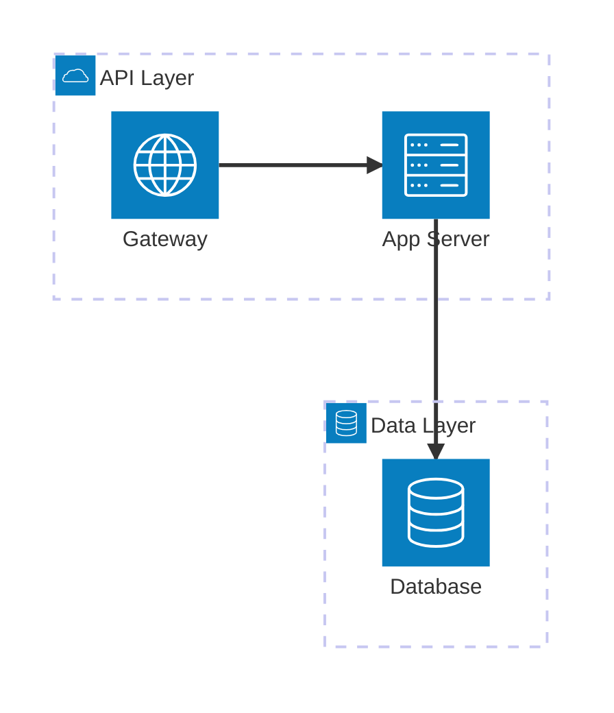

# Architecture Diagram

クラウド・CI/CDアーキテクチャの可視化。インフラ構成やデプロイメントの説明記事に活用。

## 基本構文



## グループ

```
group ID(アイコン)[ラベル]
group ID(アイコン)[ラベル] in 親グループID
```

## サービス

```
service ID(アイコン)[ラベル]
service ID(アイコン)[ラベル] in グループID
```

## エッジ（接続）

```
サービスA:方向 --> 方向:サービスB
サービスA:方向 -- 方向:サービスB
```

方向: `T`（上）、`B`（下）、`L`（左）、`R`（右）

矢印: `-->` / `<--`（方向付き）、`--`（方向なし）

グループエッジ: `server{group}:B --> T:subnet{group}`

## ジャンクション

```
junction junctionID
junction junctionID in グループID
```

4方向の接続ポイント。

## アイコン

デフォルト: `cloud`, `database`, `disk`, `internet`, `server`

iconify.design: `"name:icon-name"` 形式で200,000+アイコン使用可能。
