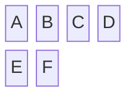
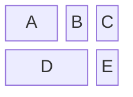
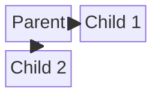

# Block Diagram

システム構成、ネットワーク、プロセスフローの可視化に最適。著者がレイアウトを制御できる。

## 基本構文

## カラム定義

## ブロック幅（スパン）

`A:2`でAが2カラム分の幅。

## ネスト（複合ブロック）

ネストには `columns` を使って親ブロック内にサブブロックを配置する:

## ブロック形状

Flowchartと同じ形状構文: `()`, `(())`, `[]`, `[[]]`, `[()]`, `{}`, `{{}}`, `[//]`, `[\\]`, `>]`, `((()))` 等

スペースブロック: `space` または `space:3`

## 接続（エッジ）

## スタイリング

