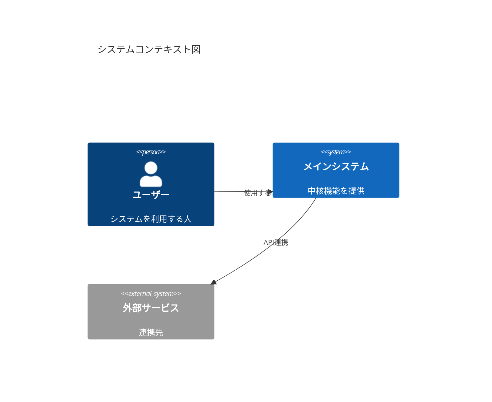
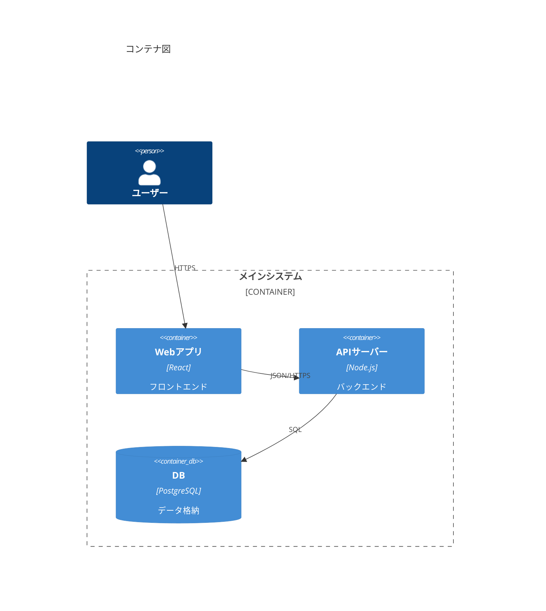

# C4 Diagram

ソフトウェアアーキテクチャの4層可視化。Context/Container/Component/Deploymentレベルの説明記事に活用。

## 図のタイプ

`C4Context`, `C4Container`, `C4Component`, `C4Dynamic`, `C4Deployment`

## System Context



## Container



## 主要要素

- `Person(alias, label, ?descr)` / `Person_Ext`
- `System(alias, label, ?descr)` / `System_Ext`
- `Container(alias, label, ?techn, ?descr)` / `Container_Ext`
- `ContainerDb`, `ContainerQueue`
- `Component(alias, label, ?techn, ?descr)`
- `Deployment_Node(alias, label, ?type, ?descr)`

## 関係

```
Rel(from, to, label, ?techn)
BiRel(from, to, label)
Rel_U / Rel_D / Rel_L / Rel_R (方向指定)
```

## スタイル調整

```
UpdateElementStyle(elementName, ?bgColor, ?fontColor, ?borderColor)
UpdateRelStyle(from, to, ?textColor, ?lineColor, ?offsetX, ?offsetY)
UpdateLayoutConfig(?c4ShapeInRow, ?c4BoundaryInRow)
```
