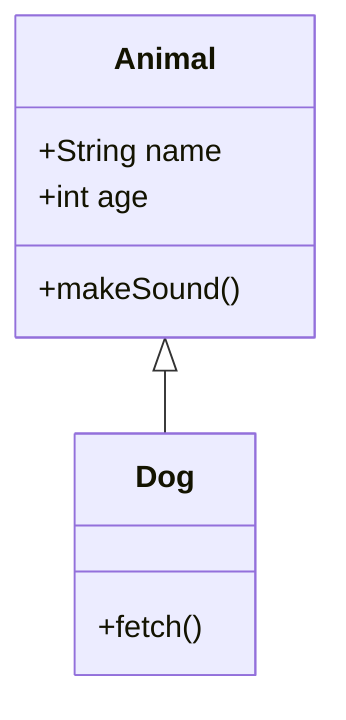
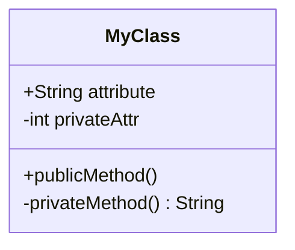
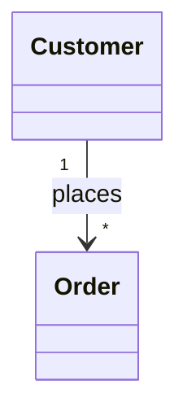
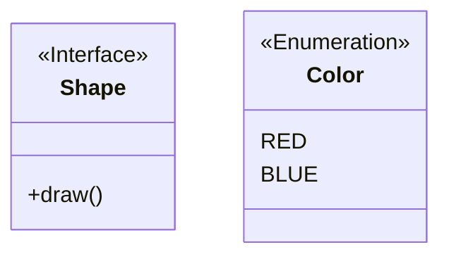
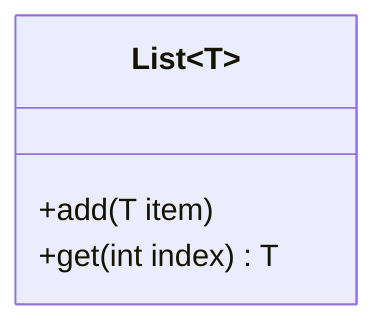
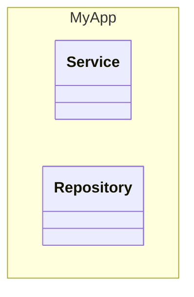
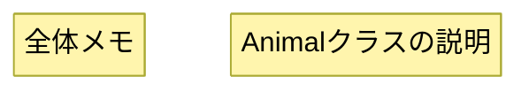
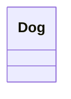

# Class Diagram

オブジェクト間の関係、型の構造、システム設計の可視化に最適。技術記事でのアーキテクチャ説明に活用。

## 基本構文



## メンバー定義

括弧`()`で属性とメソッドを区別:


## 可視性

- `+` Public
- `-` Private
- `#` Protected
- `~` Package/Internal

メソッド修飾子: `method()*`（Abstract）、`method()$`（Static）

## 関係

| 構文 | 種類 |
|------|------|
| `A <\|-- B` | 継承 |
| `A *-- B` | コンポジション |
| `A o-- B` | 集約 |
| `A --> B` | 関連 |
| `A -- B` | リンク（実線） |
| `A ..> B` | 依存 |
| `A ..\|> B` | 実現 |
| `A .. B` | リンク（点線） |

## カーディナリティ



`1`, `0..1`, `1..*`, `*`, `n`, `0..n`

## アノテーション



## ジェネリクス



## 名前空間



## ノート



## 方向

```mermaid
classDiagram
    direction LR
```

## スタイリング


