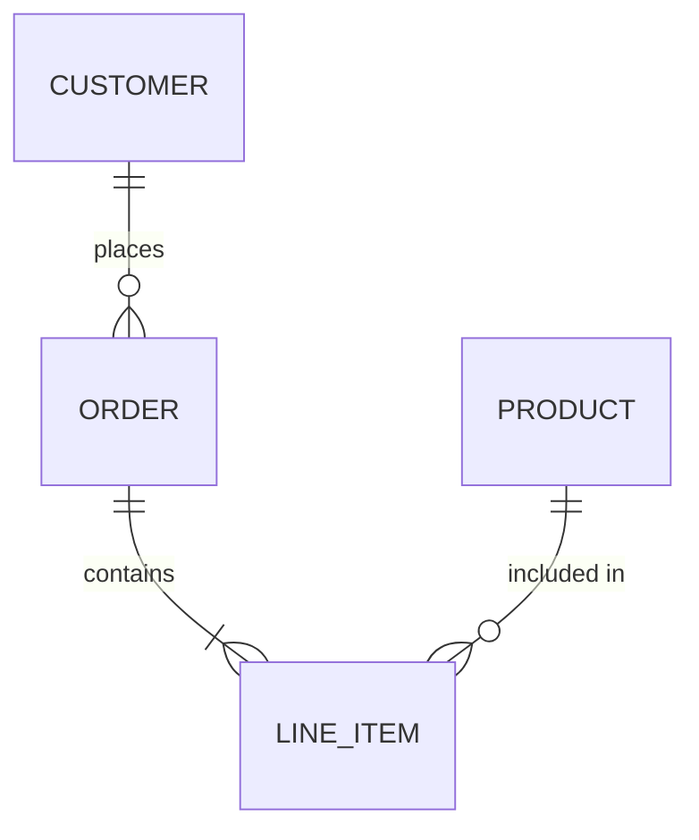
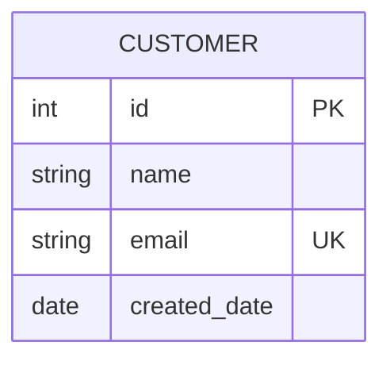

# Entity Relationship Diagram

データ構造、エンティティ間の関係の可視化に最適。DB設計やデータモデルの説明記事に活用。

## 基本構文

## カーディナリティ記号

| 左側 | 右側 | 意味 |
|------|------|------|
| `\|o` | `o\|` | 0または1 |
| `\|\|` | `\|\|` | ちょうど1 |
| `}o` | `o{` | 0以上 |
| `}\|` | `\|{` | 1以上 |

## 関係の線種

- `--`: 実線（識別関係）
- `..`: 点線（非識別関係）

## 属性

キー指定: `PK`（主キー）、`FK`（外部キー）、`UK`（ユニークキー）

コメント: `string email UK "連絡先"`

## エンティティ別名

## 方向

`TB`, `BT`, `LR`, `RL`

## スタイリング

