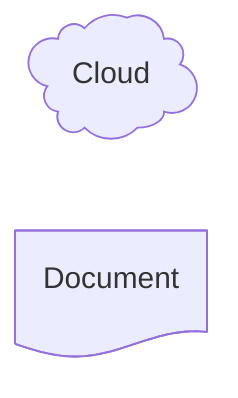
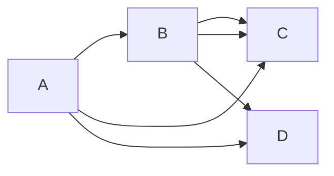
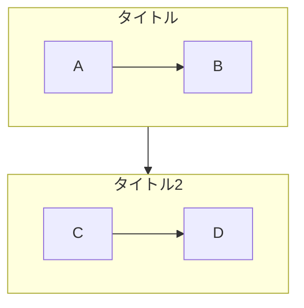
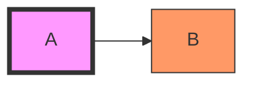
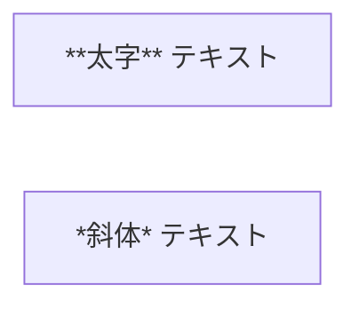

# Flowchart

プロセスの流れ、意思決定、手順の可視化に最適。Web記事で最も汎用的な図。

## 基本構文

## 方向

- `TB` / `TD`: 上→下
- `BT`: 下→上
- `LR`: 左→右
- `RL`: 右→左

## ノード形状

| 構文 | 形状 |
|------|------|
| `A[text]` | 四角形（デフォルト） |
| `A(text)` | 角丸 |
| `A([text])` | スタジアム |
| `A[[text]]` | サブルーチン |
| `A[(text)]` | 円柱（DB） |
| `A((text))` | 円 |
| `A{text}` | ひし形（判断） |
| `A{{text}}` | 六角形 |
| `A[/text/]` | 平行四辺形 |
| `A[\text\]` | 平行四辺形（逆） |
| `A[/text\]` | 台形 |
| `A[\text/]` | 台形（逆） |
| `A(((text)))` | 二重円 |
| `A>text]` | 非対称 |

### 拡張形状 (v11.3.0+)

shape: `rect`, `diam`, `cyl`, `doc`, `rounded`, `stadium`, `cloud`

## リンク（矢印）

| 構文 | 種類 |
|------|------|
| `A --> B` | 矢印 |
| `A --- B` | 線のみ |
| `A -.-> B` | 点線矢印 |
| `A ==> B` | 太線矢印 |
| `A ~~~ B` | 不可視 |
| `A -->\|text\| B` | ラベル付き |
| `A -- text --> B` | ラベル付き（別記法） |
| `A -. text .-> B` | 点線ラベル付き |
| `A == text ==> B` | 太線ラベル付き |
| `A <--> B` | 双方向 |
| `A ---o B` | 丸端 |
| `A ---x B` | ×端 |

リンク長制御: ダッシュ追加で延長 `-->`, `--->`, `---->`

## チェーン・複数接続

## サブグラフ

## スタイリング

複数ノード: `class A,B,C highlight`

リンクスタイル: `linkStyle 0 stroke:#ff3,stroke-width:4px`

## Markdownテキスト

## コメント

