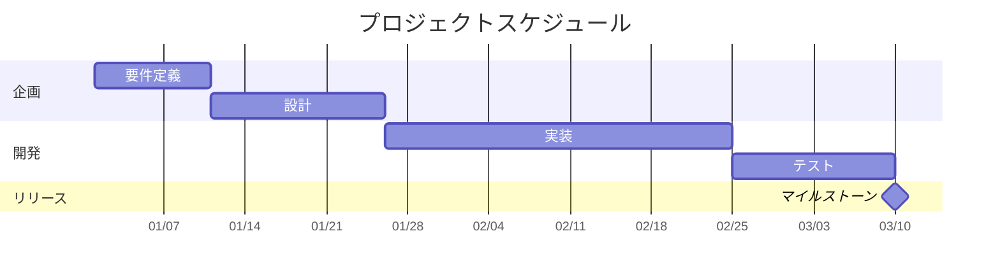
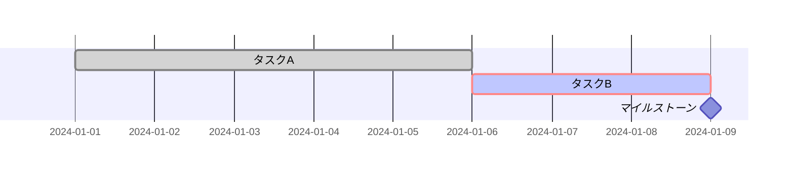

# Gantt Chart

プロジェクトスケジュール、タスクの時系列管理の可視化に最適。

## 基本構文



## タスクのメタデータ

タグ: `active`（進行中）、`done`（完了）、`crit`（クリティカル）、`milestone`



## 期間指定

`ms`, `s`, `m`, `h`, `d`, `w`, `M`, `y`（小数可: `1.5d`）

## 日付フォーマット

- 入力: `dateFormat YYYY-MM-DD`
- 表示: `axisFormat %Y-%m-%d`

## 除外日

```mermaid
gantt
    excludes weekends
    excludes 2024-12-25, 2024-12-26
```

## 依存関係

`after タスクID` で依存指定。`until タスクID` で終了時点指定。

## 垂直マーカー

`tickInterval` ディレクティブで目盛り間隔を指定:

```
tickInterval 1week
```

## 今日マーカー

`todayMarker off` で非表示。`todayMarker stroke-width:5px,stroke:#0f0` でカスタム。
