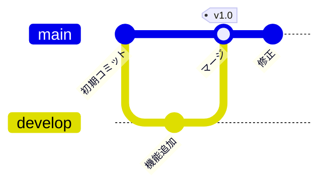
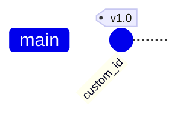
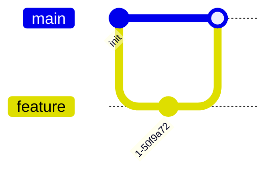
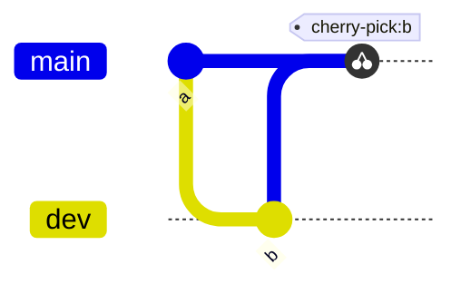
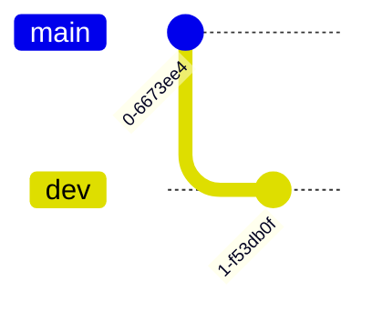

# GitGraph

Gitのブランチ戦略・コミット履歴の可視化に最適。Git運用やブランチモデルの説明記事に活用。

## 基本構文



## コミット



タイプ: `NORMAL`（通常）、`REVERSE`（×印）、`HIGHLIGHT`（強調）

## ブランチ操作

mainに最低1つコミットしてからブランチを作成すること:



`checkout`と`switch`は同義。

## チェリーピック



## 方向



方向は設定ブロックで指定: `LR`（左→右、デフォルト）、`TB`（上→下）、`BT`（下→上）

## 設定

```
%%{init: { 'gitGraph': { 'showBranches': true, 'showCommitLabel': true, 'mainBranchName': 'main' } } }%%
```
