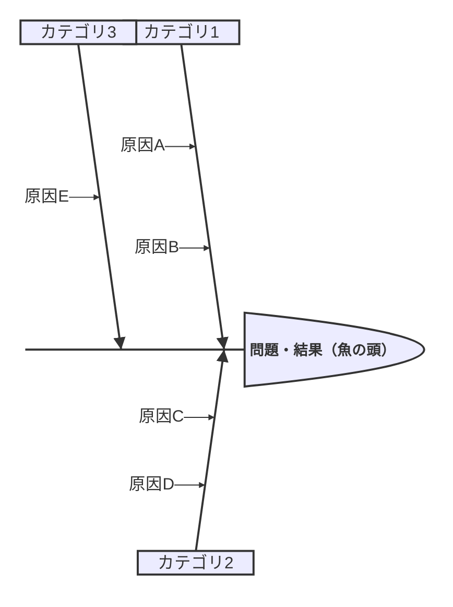

# Ishikawa (Fishbone) Diagram

原因分析・問題の根本原因の可視化に最適。品質管理やトラブルシューティングの記事に活用。(v11.12.3+)

## 基本構文

## 構造

1. **1行目**: 主要な問題・結果（魚の頭）
2. **2行目以降**: カテゴリと原因をインデントで階層化
3. フィッシュボーン構造はインデントで表現

## 注意

- v11.12.3以降で利用可能
- 新しい図種のため構文が将来変更される可能性あり
