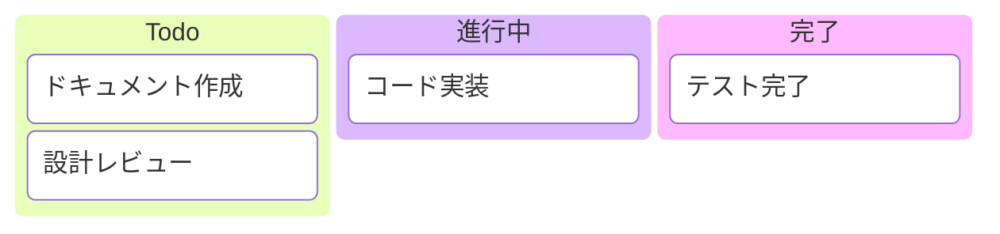
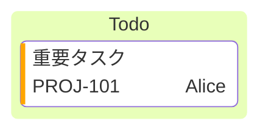

# Kanban

タスク管理・ワークフローステータスの可視化。プロジェクト管理やアジャイル手法の記事に活用。

## 基本構文



## カラム定義

```
カラムID[カラムタイトル]
```

## タスク定義

カラムの下にインデントして配置:
```
タスクID[タスク説明]
```

## メタデータ



- `assigned`: 担当者
- `ticket`: チケット番号
- `priority`: `Very High`, `High`, `Low`, `Very Low`

## チケットリンク設定

```
---
config:
  kanban:
    ticketBaseUrl: 'https://project.atlassian.net/browse/#TICKET#'
---
```
