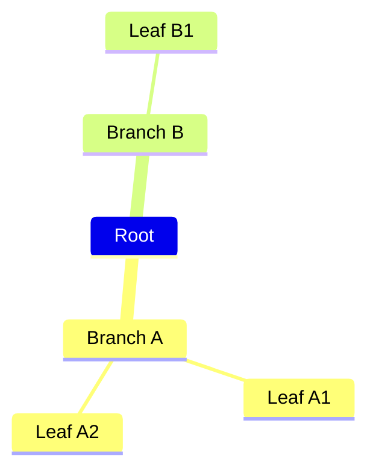

# Mindmap

概念の全体像、関連性、カテゴリ分類の可視化に最適。記事の要点整理や概念マップとして活用。

## 基本構文



インデントで階層を定義。ルートノードは1つのみ。

## ノード形状

| 構文 | 形状 |
|------|------|
| `Default` | デフォルト（装飾なし） |
| `[Square]` | 四角 |
| `(Rounded)` | 角丸 |
| `((Circle))` | 円 |
| `)Bang(` | 爆発 |
| `)Cloud}` | 雲 |
| `{{Hexagon}}` | 六角形 |

## アイコン

```
mindmap
    Root::icon(fas fa-rocket)
        Node::icon(fas fa-star)
```

Font Awesome / Material Design アイコンを使用。

## カスタムスタイル

```
mindmap
    Root
        Important:::urgent
```

CSSクラスを適用。

## Markdownサポート

```
mindmap
    Root
        **太字** と *斜体*
        テキストは自動折り返し
```

## レイアウト設定

```
---
config:
  layout: tidy-tree
---
mindmap
    Root
        A
        B
```
