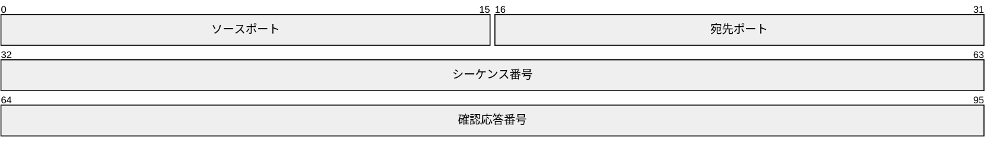
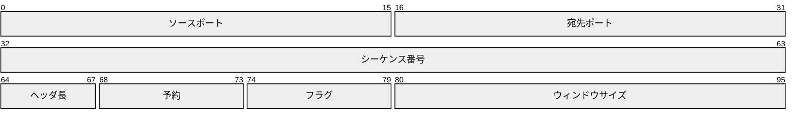

# Packet Diagram

ネットワークパケット構造の可視化。プロトコル解説や通信技術の記事に活用。

## 基本構文

```mermaid
packet
    0-15: "ソースポート"
    16-31: "宛先ポート"
    32-63: "シーケンス番号"
    64-95: "確認応答番号"
```

## ビット構文 (v11.7.0+)

```mermaid
packet
    +16: "ソースポート"
    +16: "宛先ポート"
    +32: "シーケンス番号"
    +4: "ヘッダ長"
    +6: "予約"
    +6: "フラグ"
    +16: "ウィンドウサイズ"
```

`+N`で自動的にビット位置を計算。

## ルール

- 範囲指定: `開始-終了: "フィールド名"`
- 自動計算: `+ビット数: "フィールド名"`
- フィールド名はダブルクォートで囲む
