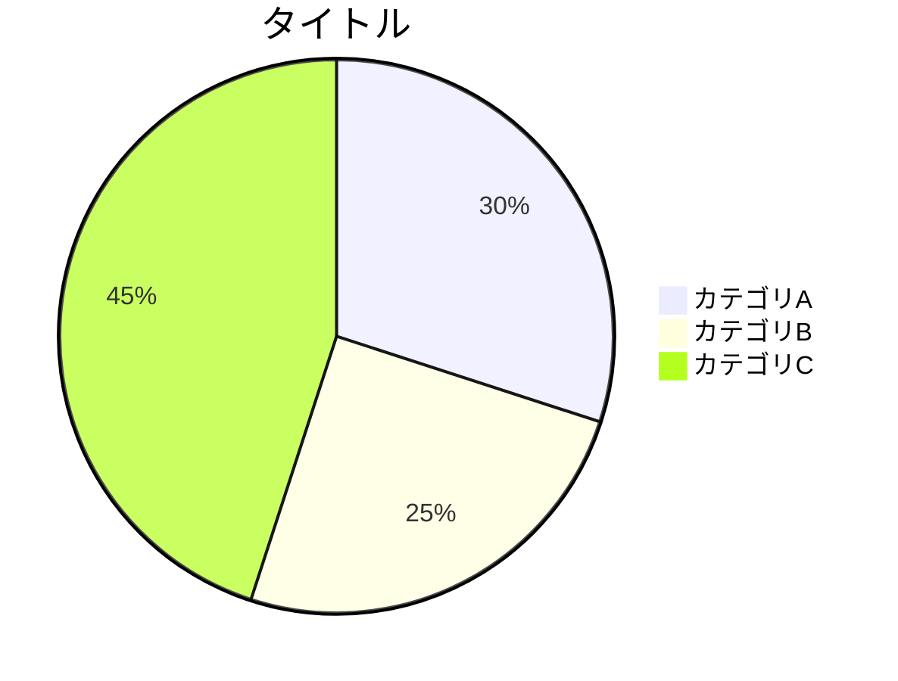
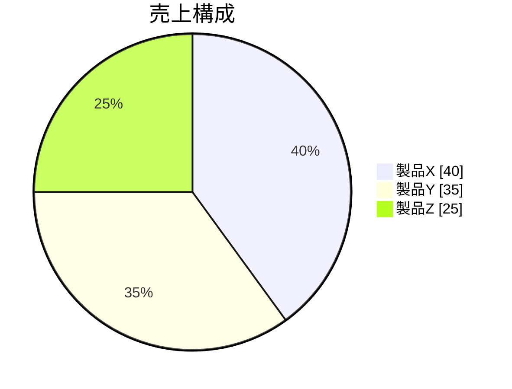

# Pie Chart

割合・比率・構成比の可視化に最適。アンケート結果やシェア分析に活用。

## 基本構文

```mermaid
pie title タイトル
    "カテゴリA" : 30
    "カテゴリB" : 25
    "カテゴリC" : 45
```

## データ値表示

```mermaid
pie showData title 売上構成
    "製品X" : 40
    "製品Y" : 35
    "製品Z" : 25
```

## 制約

- 値は**正の数値のみ**（0より大きい）
- 小数点以下2桁まで
- スライスは記述順に時計回りで描画
