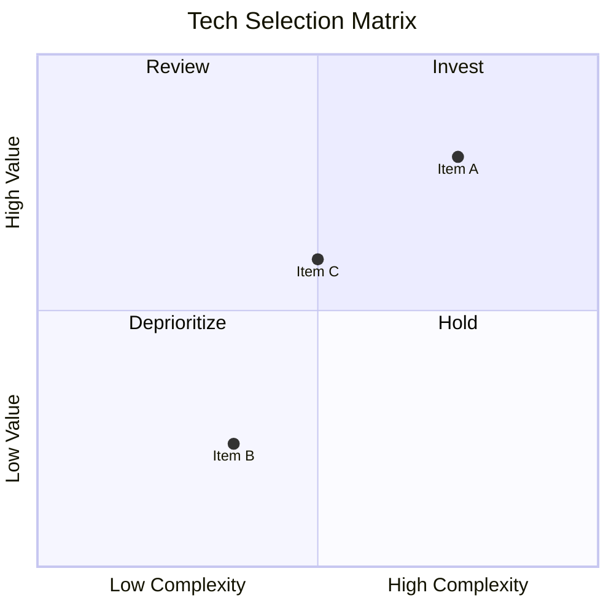

# Quadrant Chart

2軸での比較・分類・優先度マトリクスに最適。戦略分析や意思決定の可視化に活用。

> **制約: 軸ラベル・象限名・ポイント名に日本語は使用不可。** 英語で記述し、記事本文で日本語の説明を添えること。

## 基本構文

## 構成要素

- `title`: チャートタイトル（英語のみ）
- `x-axis`: X軸（左ラベル → 右ラベル、英語のみ）
- `y-axis`: Y軸（下ラベル → 上ラベル、英語のみ）
- `quadrant-1`: 右上（1）、`quadrant-2`: 左上（2）、`quadrant-3`: 左下（3）、`quadrant-4`: 右下（4）
- ポイント: `名前: [x, y]`（0〜1の範囲、名前は英語のみ）
