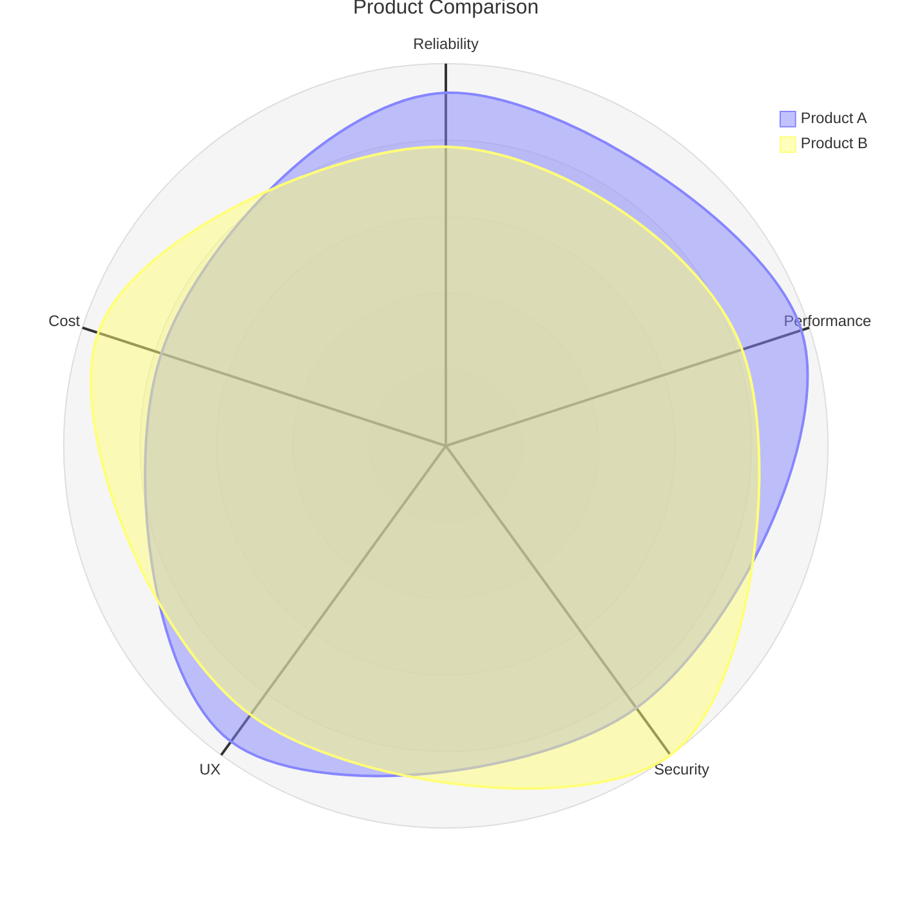
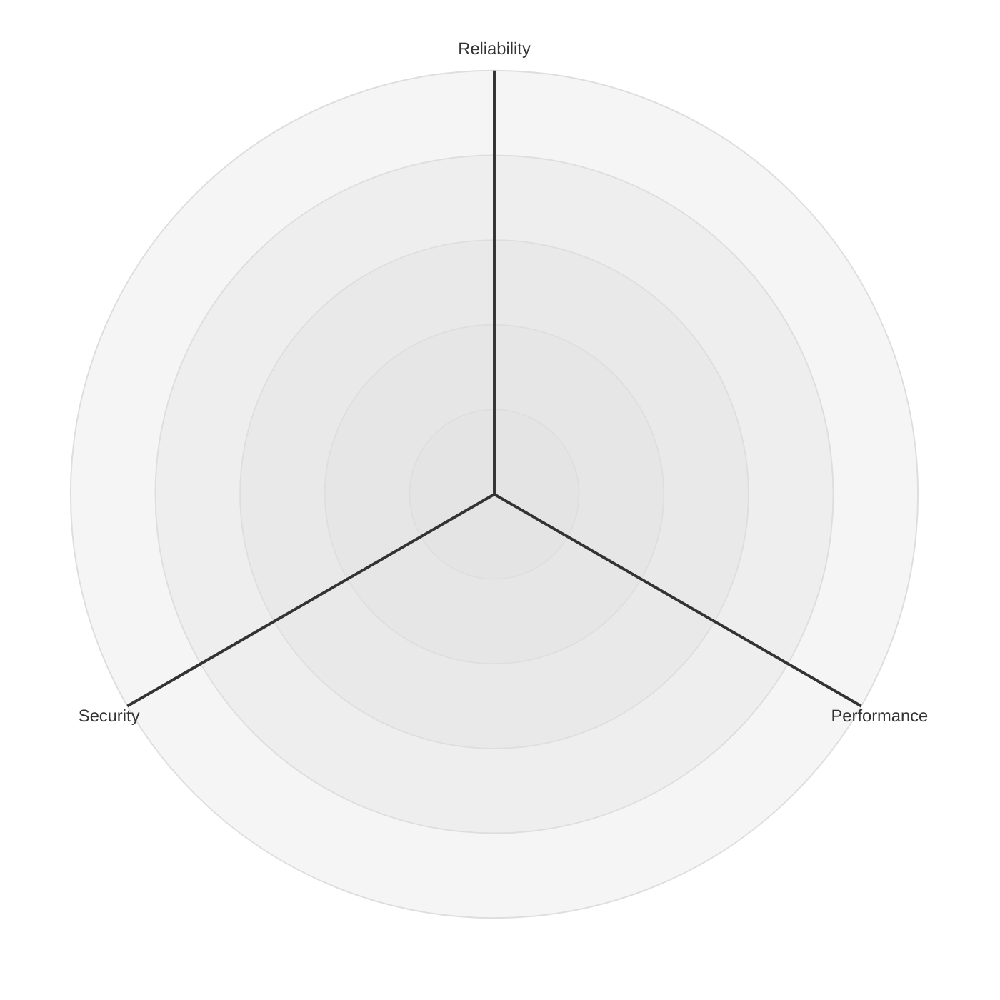

# Radar Chart

多軸での比較・能力評価・バランス分析の可視化に最適。製品比較やスキル評価の記事に活用。(v11.6.0+)

> **制約: 軸ラベルに日本語は使用不可。** 英語で記述し、記事本文で日本語の説明を添えること。

## 基本構文



## 軸定義



## データ系列（Curve）

位置指定: `curve name{値1, 値2, 値3}`
キー指定: `curve name{axis1: 30, axis2: 20}`
複数一行: `curve c1{5,4,3}, c2{7,8,9}`

## 設定

```
---
config:
  radar:
    showLegend: true
    max: 100
    min: 0
    ticks: 5
    graticule: circle
---
```

- `graticule`: `circle`（円）または `polygon`（多角形）
- `ticks`: 同心円/線の本数
