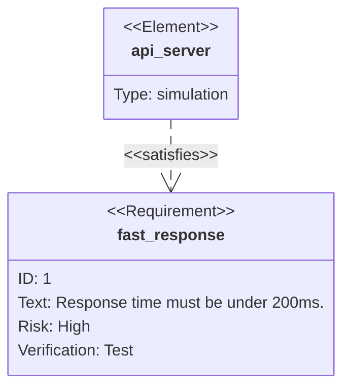

# Requirement Diagram

要件とその関係の可視化に最適。SysML v1.6準拠。要件定義や仕様の説明記事に活用。

> **制約: 要件名・要素名に日本語やスペースは使用不可。** アンダースコア区切りの英語で記述し、記事本文で日本語の説明を添えること。`id` にはハイフン不可（アンダースコアまたは数字のみ）。

## 基本構文



## 要件タイプ

`requirement`, `functionalRequirement`, `interfaceRequirement`, `performanceRequirement`, `physicalRequirement`, `designConstraint`

## リスクレベル

`Low`, `Medium`, `High`

## 検証方法

`Analysis`, `Inspection`, `Test`, `Demonstration`

## 要素（Element）

```
element 名前 {
    type: タイプ
    docref: 参照先
}
```

## 関係

```
{source} - <type> -> {destination}
```

タイプ: `contains`, `copies`, `derives`, `satisfies`, `verifies`, `refines`, `traces`

## 方向

`direction TB` / `BT` / `LR` / `RL`
