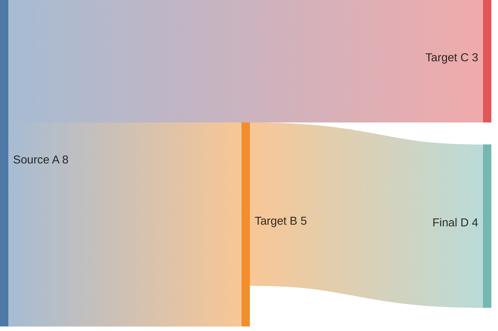
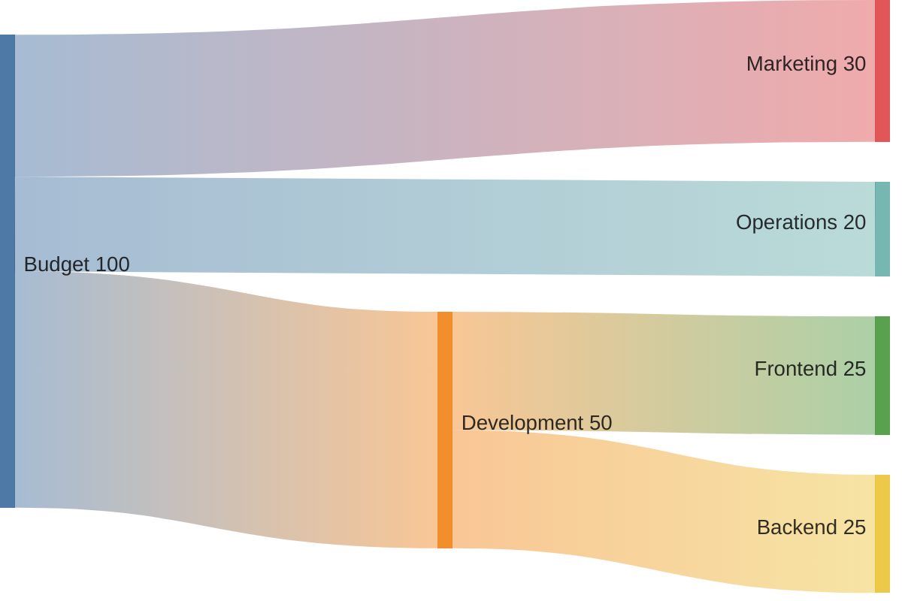

# Sankey Diagram

フロー量・資源の流れ・変換過程の可視化に最適。エネルギーフロー、予算配分、コンバージョンの説明に活用。

## 基本構文

> **重要: データ行はインデントしないこと。** 行頭からカンマ区切りで記述する。



## CSV形式

3列: ソース, ターゲット, 値



## ルール

- カンマ含む値はダブルクォートで囲む
- 空行可（整理用）
- 3列固定

## 設定

```
---
config:
  sankey:
    linkColor: gradient
    nodeAlignment: justify
---
```

- `linkColor`: `source`, `target`, `gradient`, `#hexcode`
- `nodeAlignment`: `justify`, `center`, `left`, `right`
