# Sequence Diagram

時系列の対話・メッセージの流れを可視化。システム間連携やユーザーとサービスのやり取りを説明する記事に最適。

## 基本構文

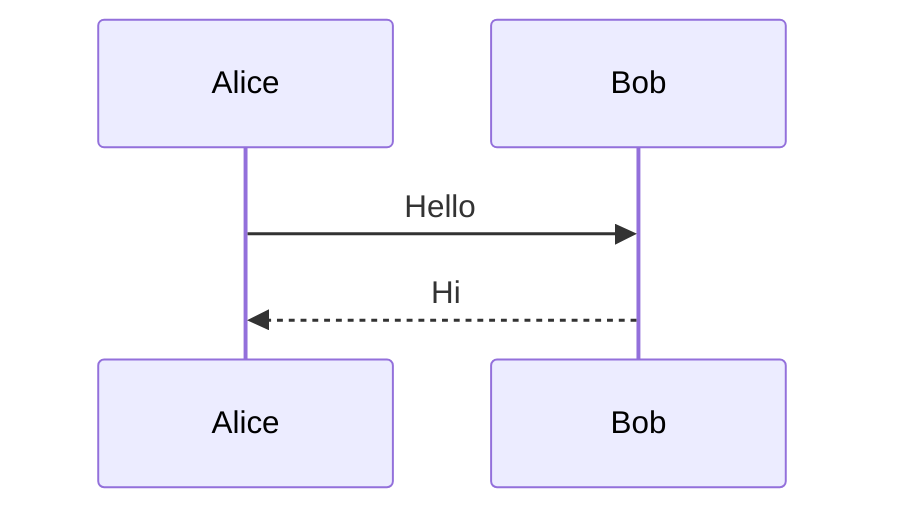

## 参加者の宣言

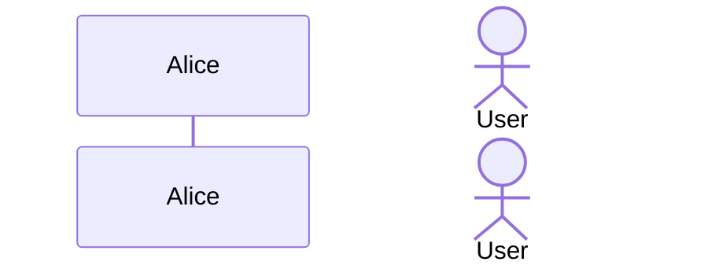

タイプ指定: `participant A {"type": "database"}` (boundary, control, entity, database, collections, queue)

## グループ化（Box）

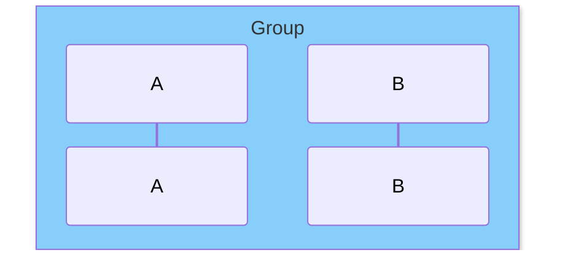

色は `rgb(r,g,b)` 形式で指定。色名（Aqua等）はレンダラーによって非対応の場合がある。

## メッセージ矢印

| 構文 | 種類 |
|------|------|
| `->` | 実線（矢印なし） |
| `-->` | 点線（矢印なし） |
| `->>` | 実線＋矢印 |
| `-->>` | 点線＋矢印 |
| `<<->>` | 双方向（実線） |
| `<<-->>` | 双方向（点線） |
| `-x` | 実線＋×（失敗） |
| `--x` | 点線＋× |
| `-)` | 非同期（実線） |
| `--)` | 非同期（点線） |

## アクティベーション

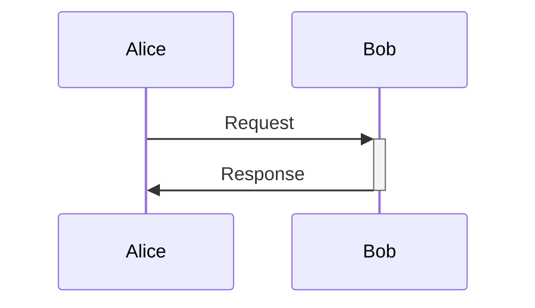

明示的: `activate Bob` / `deactivate Bob`

## ノート

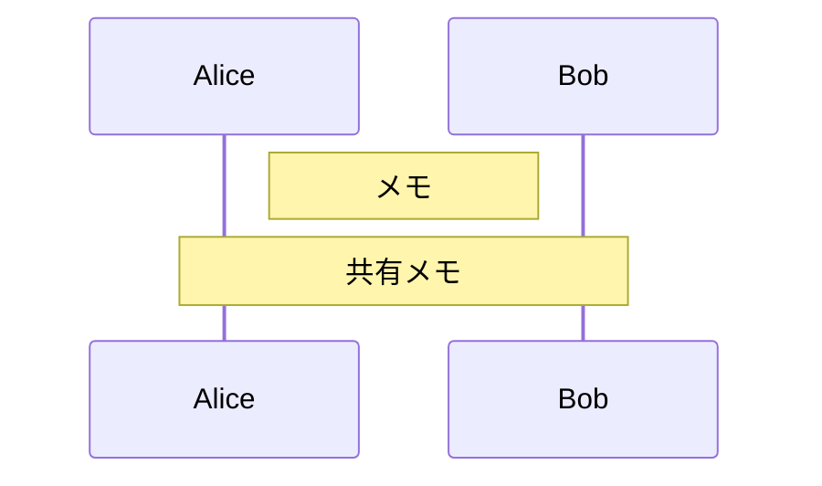

改行: ` `

## 制御構造

### ループ
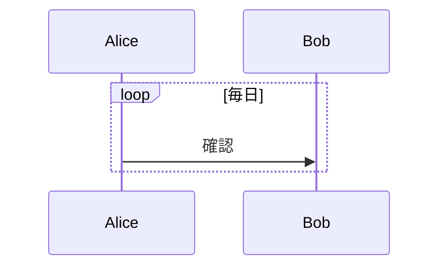

### 分岐（Alt/Else）
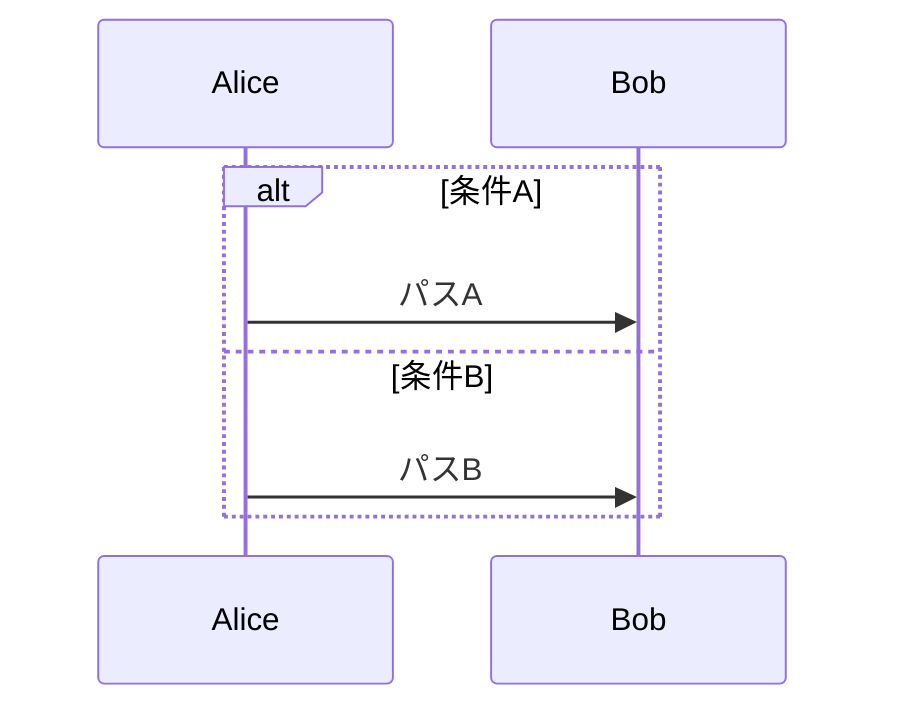

### オプション（Opt）
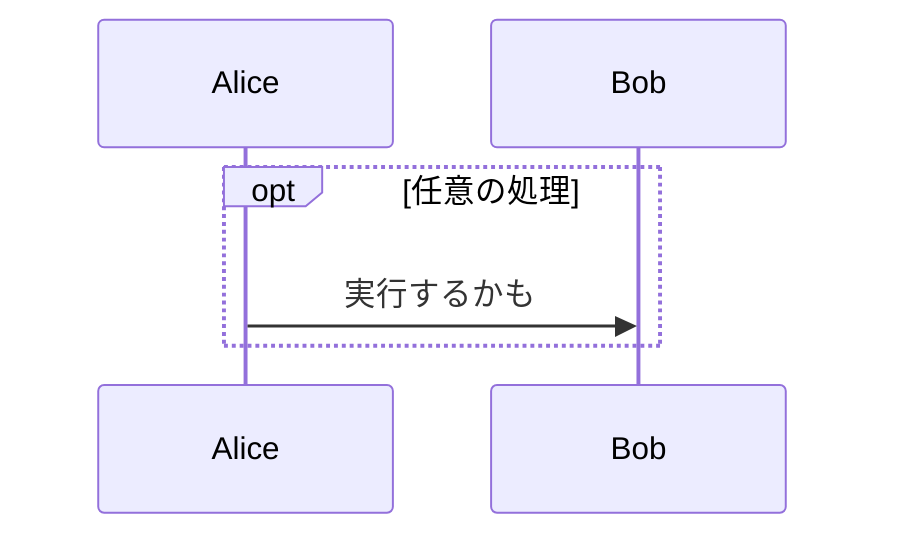

### 並列（Par）
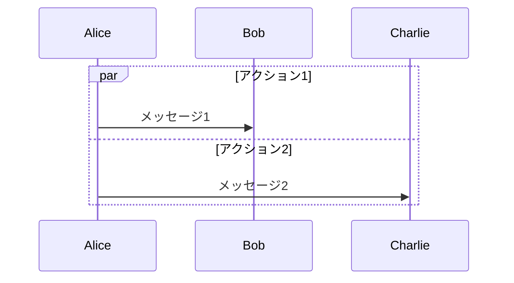

### クリティカル
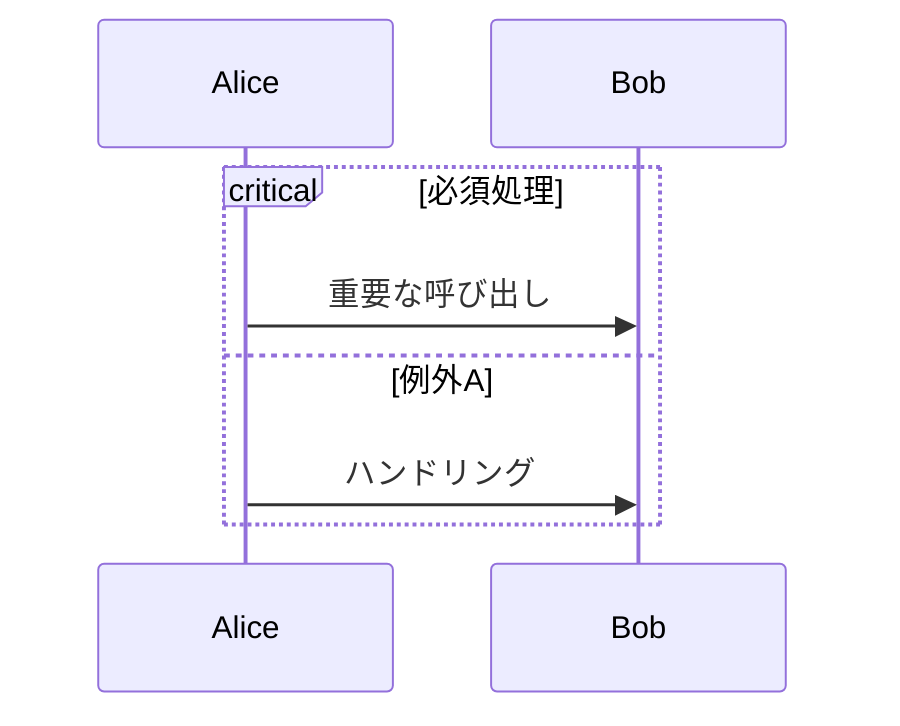

### ブレイク
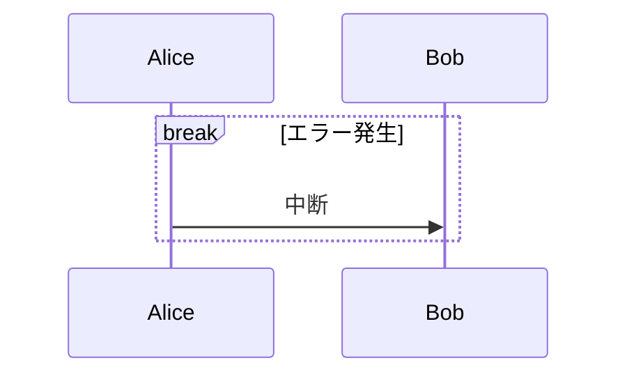

## 背景色ハイライト

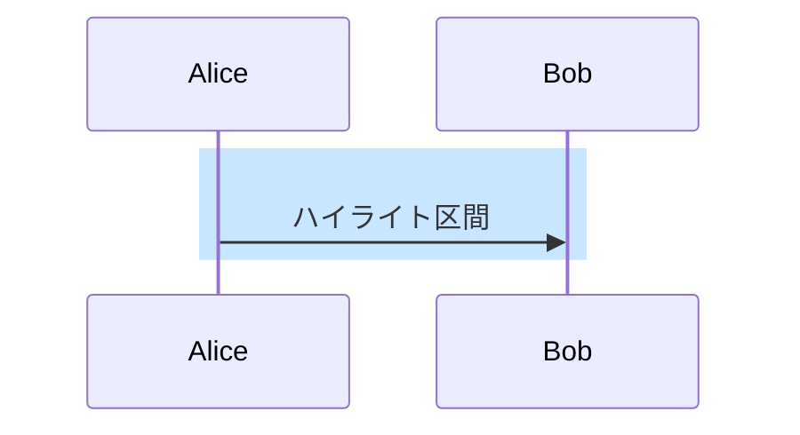

## 連番表示

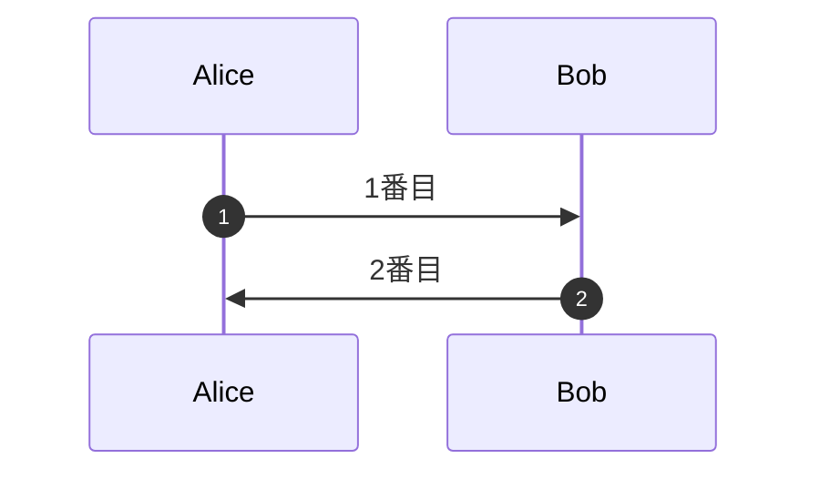

## 参加者の生成・破棄

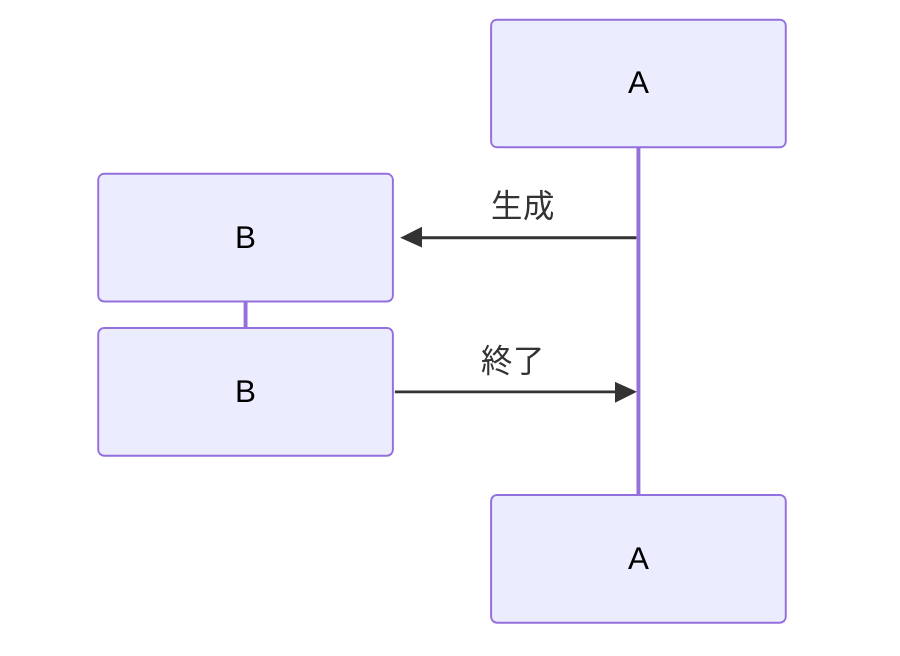
