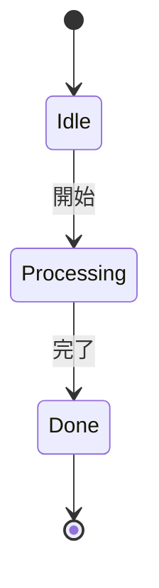
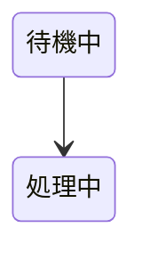
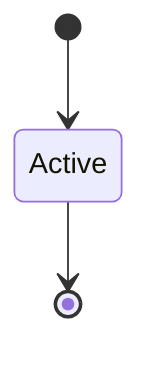
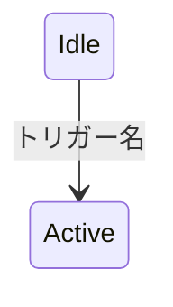
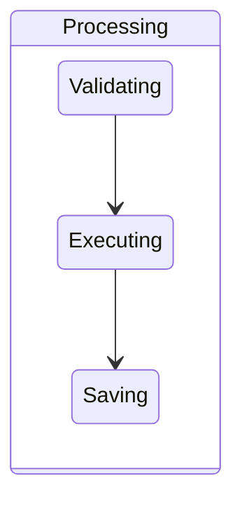
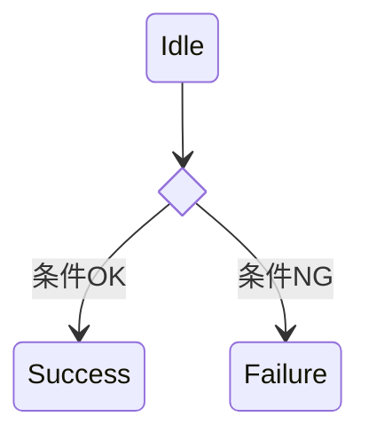
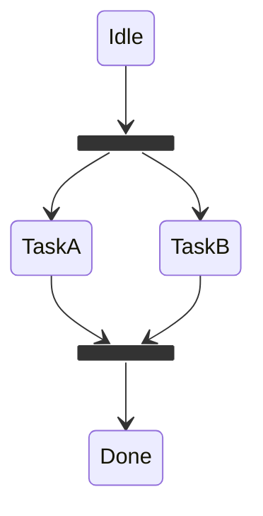
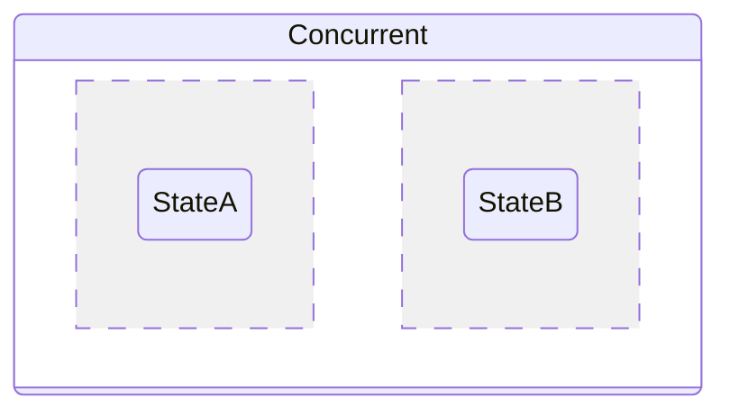
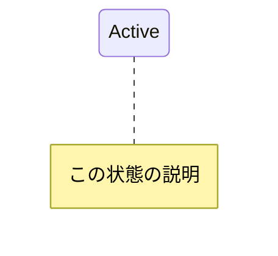
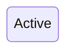

# State Diagram

状態遷移、ライフサイクル、ステータスフローの可視化に最適。ワークフローや状態管理の説明記事に活用。

## 基本構文



## 状態の定義



コロン記法: `StateA: この状態の説明`

## 開始・終了

`[*]`を使用。矢印の方向で開始/終了を区別:


## 遷移ラベル



## 複合状態



ネスト可能。

## 選択（分岐）



## フォーク・ジョイン



## 並行状態



## ノート



## 方向

```mermaid
stateDiagram-v2
    direction LR
```

`LR`, `RL`, `TB`, `BT`

## スタイリング


