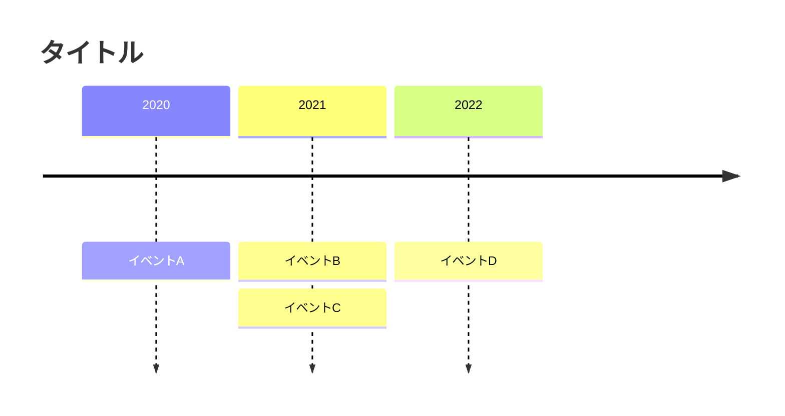
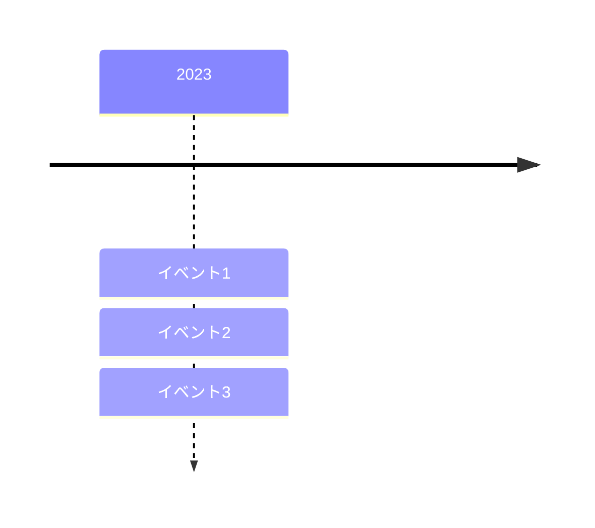
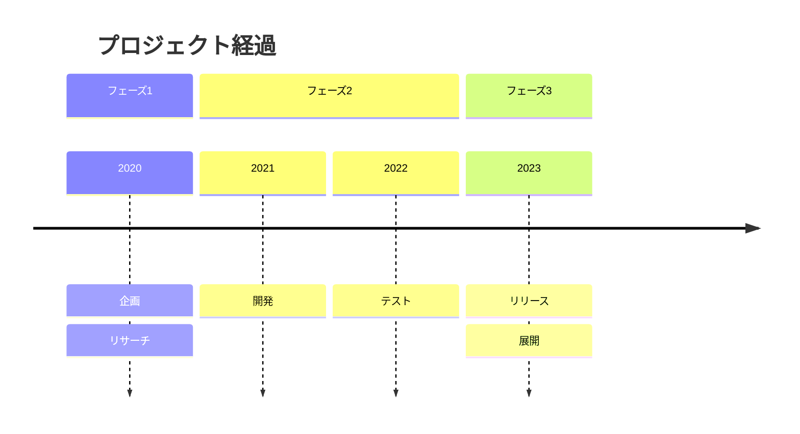
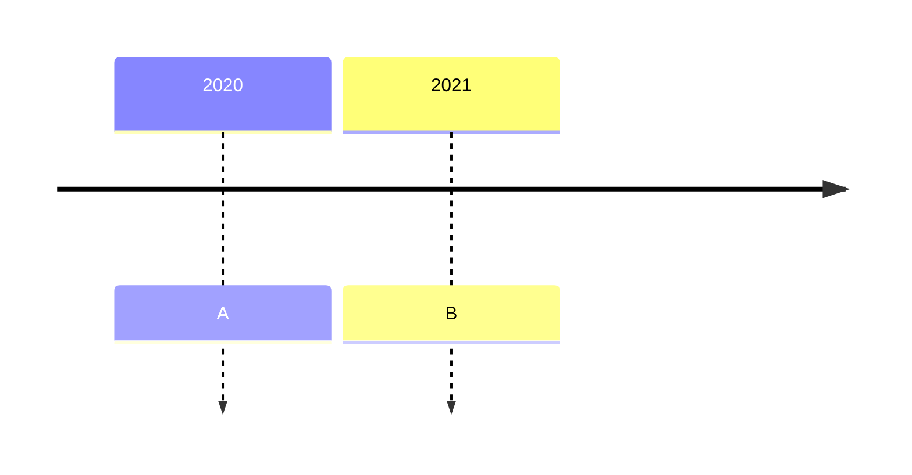
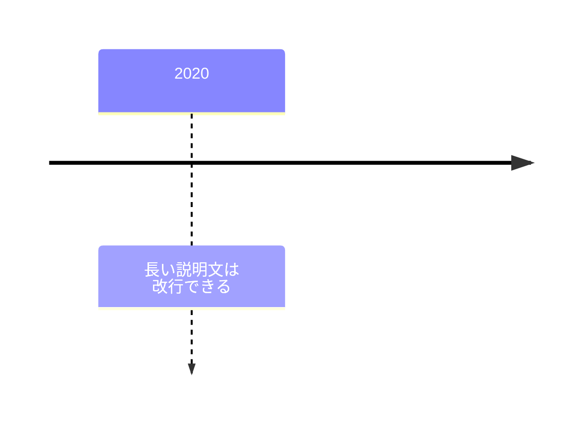

# Timeline

時系列の出来事・歴史・プロジェクト経過の可視化に最適。

## 基本構文

```mermaid
timeline
    title タイトル
    2020 : イベントA
    2021 : イベントB : イベントC
    2022 : イベントD
```

## 複数イベント

```mermaid
timeline
    2023 : イベント1 : イベント2 : イベント3
```

または改行:

```mermaid
timeline
    2023 : イベント1
         : イベント2
         : イベント3
```

## セクション分け

```mermaid
timeline
    title プロジェクト経過
    section フェーズ1
        2020 : 企画 : リサーチ
    section フェーズ2
        2021 : 開発
        2022 : テスト
    section フェーズ3
        2023 : リリース : 展開
```

## 方向設定 (v11.14.0+)

```mermaid
timeline LR
    2020 : A
    2021 : B
```

`LR`（左→右、デフォルト）、`TD`（上→下）

## テキスト改行

```mermaid
timeline
    2020 : 長い説明文は<br>改行できる
```
