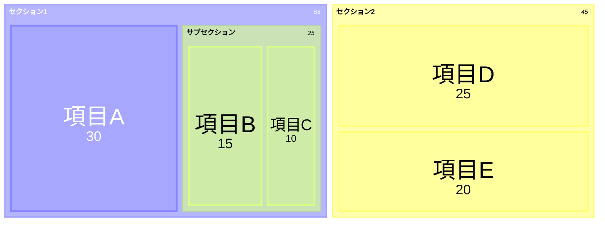

# Treemap

階層データの面積比較に最適。予算配分、ディスク使用量、市場シェアの可視化に活用。

## 基本構文



## ノードタイプ

- **親ノード**: `"セクション名"`（値なし）
- **リーフノード**: `"項目名": 値`（値で面積決定）
- **階層**: インデントで親子関係を定義

## スタイリング

treemap-betaではリーフノードへの `:::class` 構文は未対応。テーマ設定で色をカスタマイズする:

```
---
config:
  theme: base
  themeVariables:
    primaryColor: "#ff6666"
---
```

## 値フォーマット

D3形式: `,`（千区切り）、`$`（通貨）、`.1f`（小数1桁）、`.1%`（パーセント）

## 設定

| オプション | 説明 | デフォルト |
|-----------|------|----------|
| `padding` | 内部余白 | 10 |
| `showValues` | 値表示 | true |
| `valueFontSize` | 値フォントサイズ | 12 |
| `labelFontSize` | ラベルフォントサイズ | 14 |
