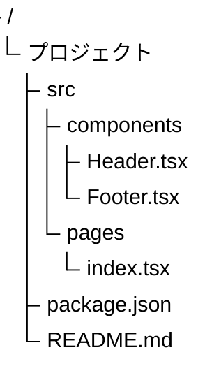

# TreeView

ディレクトリ構造・階層データのツリー表示に最適。ファイル構成やカテゴリ体系の可視化に活用。(v11.14.0+)

## 基本構文

## ルール

- ダブルクォートでノード名を囲む
- インデントで親子関係を定義
- 特別な接続構文は不要

## 設定

| プロパティ | 説明 | デフォルト |
|-----------|------|----------|
| `rowIndent` | インデント幅 | 10 |
| `paddingX` | 横余白 | 5 |
| `paddingY` | 縦余白 | 5 |
| `lineThickness` | 線の太さ | 1 |

## テーマ

| プロパティ | 説明 | デフォルト |
|-----------|------|----------|
| `labelFontSize` | フォントサイズ | 16px |
| `labelColor` | 文字色 | black |
| `lineColor` | 線色 | black |
