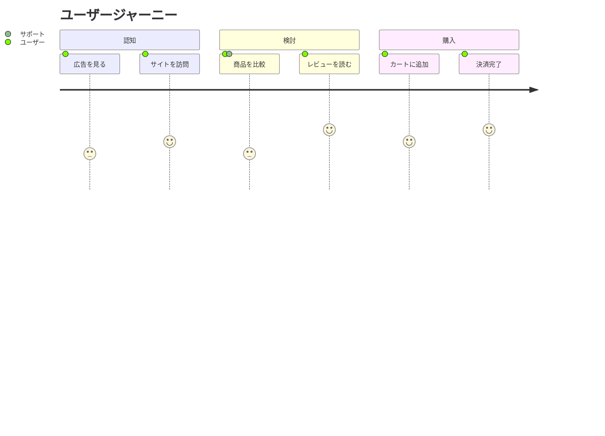

# User Journey

ユーザー体験の流れ・満足度の可視化に最適。UX改善やカスタマージャーニーの説明記事に活用。

## 基本構文



## タスク構文

```
タスク名: スコア: アクター1, アクター2
```

- **スコア**: 1〜5（1=不満、5=満足）
- **アクター**: カンマ区切りで複数指定可

## セクション

ワークフローのフェーズを`section`で分割。
