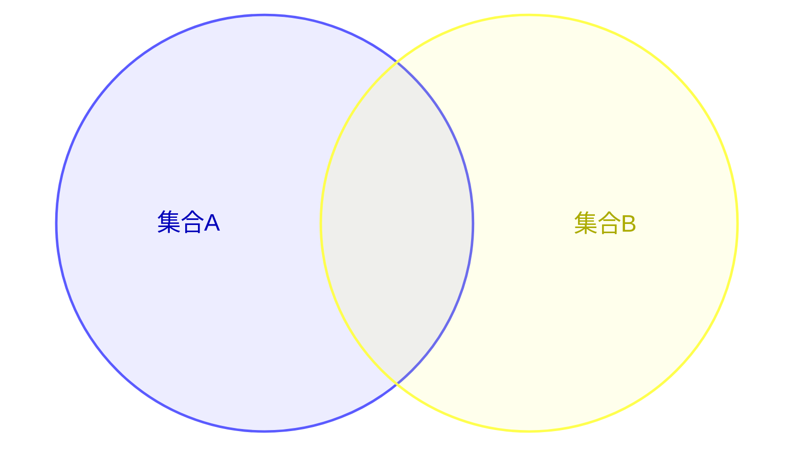
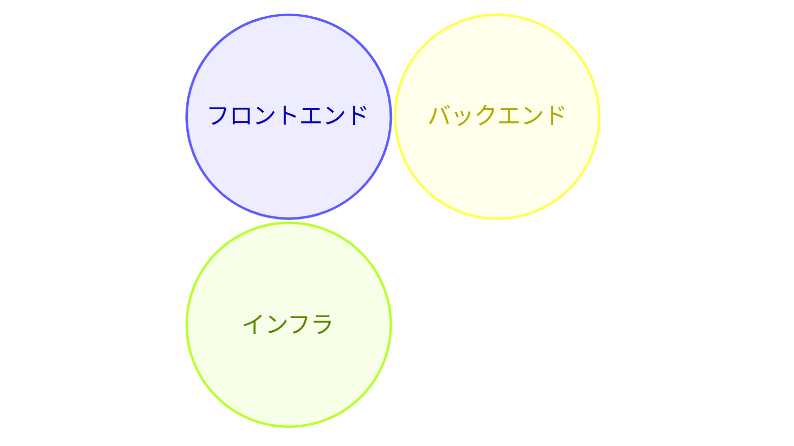
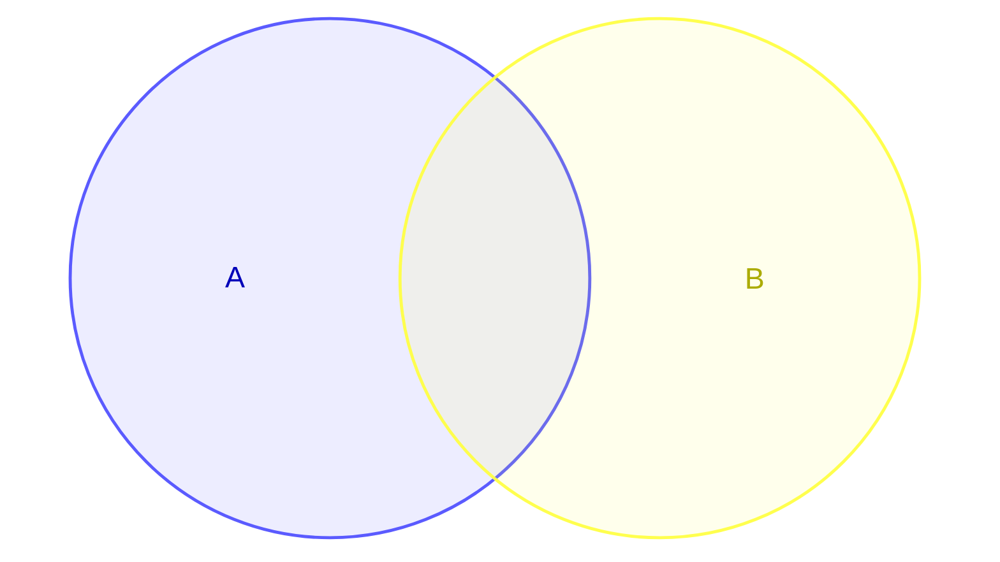
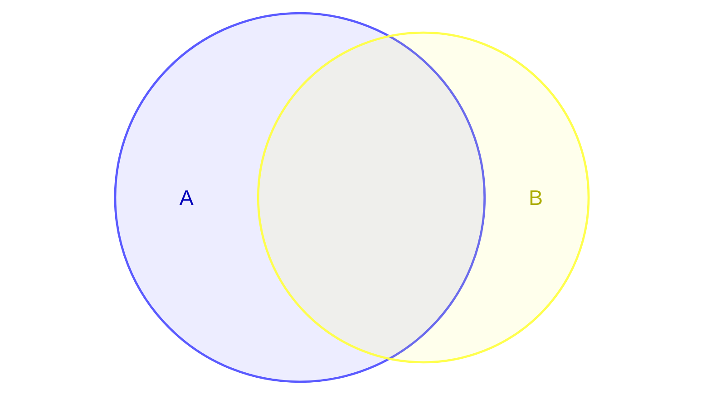
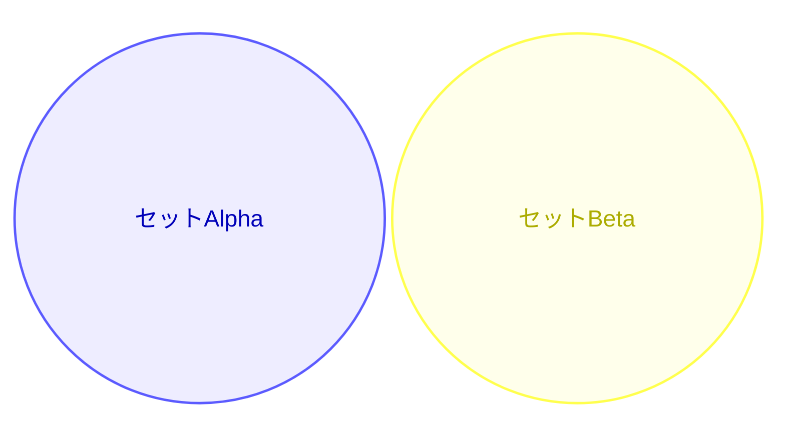

# Venn Diagram

集合の重なり・共通点・差異の可視化に最適。概念の比較や分類の記事に活用。(v11.12.3+ beta)

## 基本構文

## セット定義

## ユニオン（共通部分）

参照するIDは事前に`set`で定義済みであること。

## サイズ指定

`:N`でサイズを制御。

## カスタムラベル

## スタイリング

`fill`, `color`, `stroke`, `stroke-width`, `fill-opacity`
