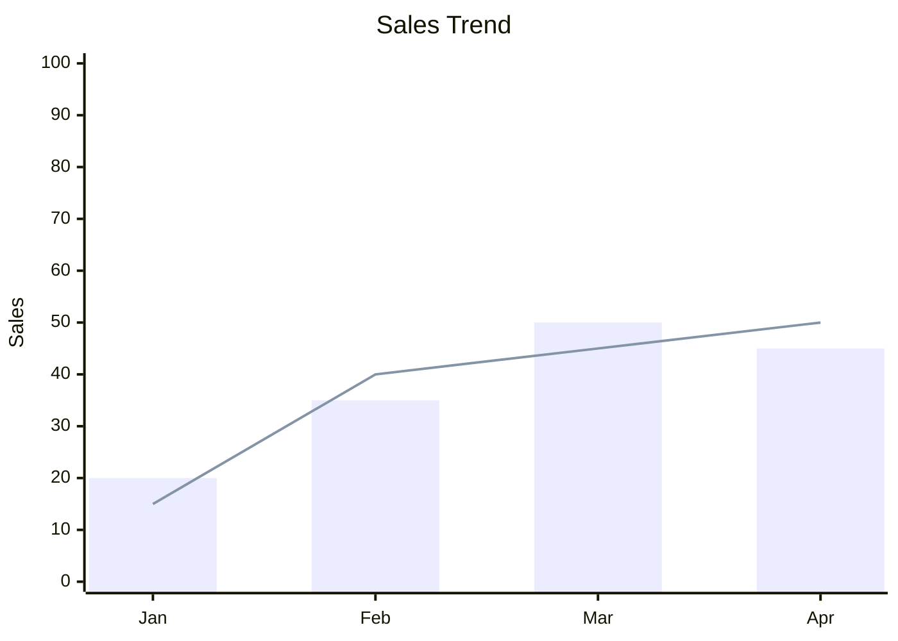
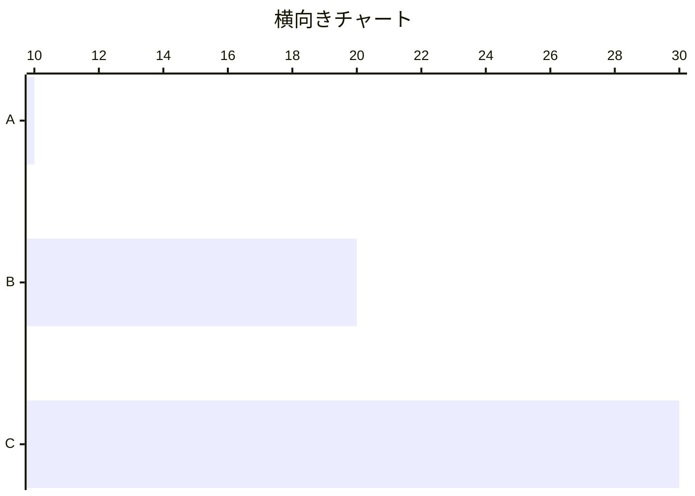

# XY Chart

数値データの比較・推移の可視化に最適。棒グラフと折れ線グラフを組み合わせ可能。

> **制約: X軸のカテゴリラベルに日本語は使用不可。** 英語・数字で記述し、記事本文で日本語の説明を添えること。タイトルやY軸タイトルはクォート付きで日本語可。

## 基本構文



## 方向



## 軸設定

### X軸（カテゴリまたは数値）

カテゴリ: `x-axis "タイトル" [cat1, "cat 2", cat3]`
数値: `x-axis タイトル min --> max`

### Y軸（数値のみ）

`y-axis "タイトル" min --> max`（省略時は自動）

## チャートタイプ

- `bar [値1, 値2, ...]`: 棒グラフ
- `line [値1, 値2, ...]`: 折れ線グラフ

小数・負の値に対応。

## データラベル表示

```
---
config:
  xyChart:
    showDataLabel: true
---
```

## テーマ設定

```
---
config:
  themeVariables:
    xyChart:
      titleColor: "#ff0000"
      plotColorPalette: "#f00,#0f0,#00f"
---
```
